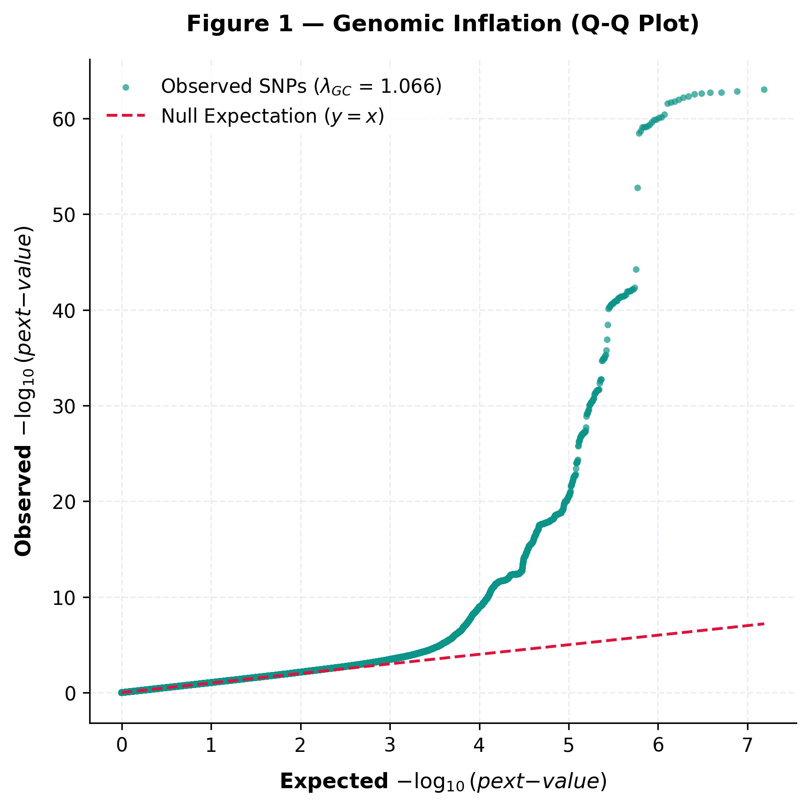
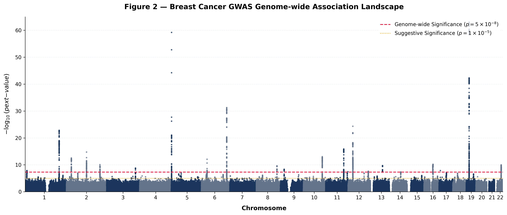
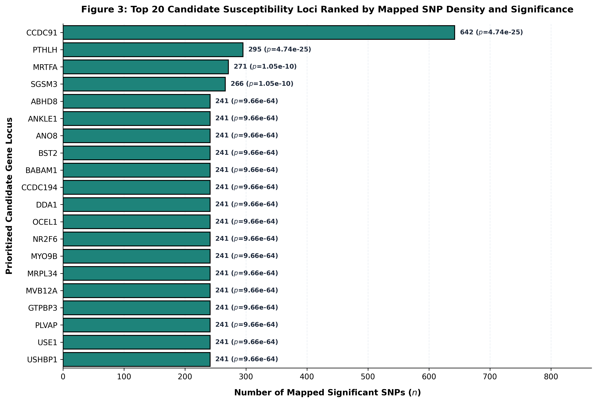
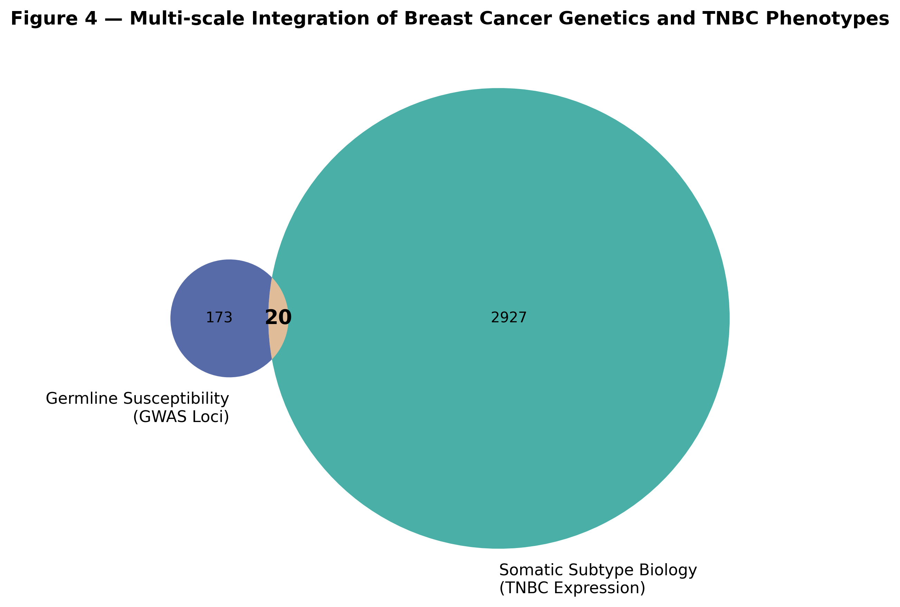
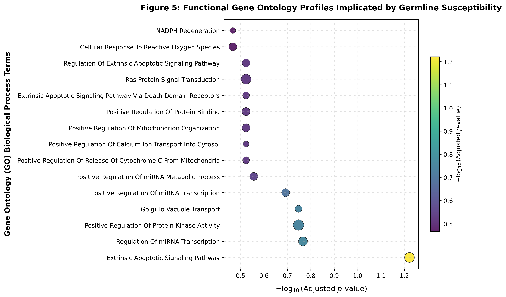
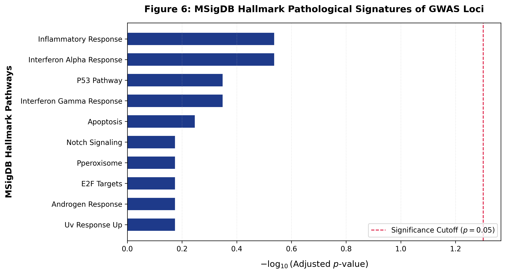
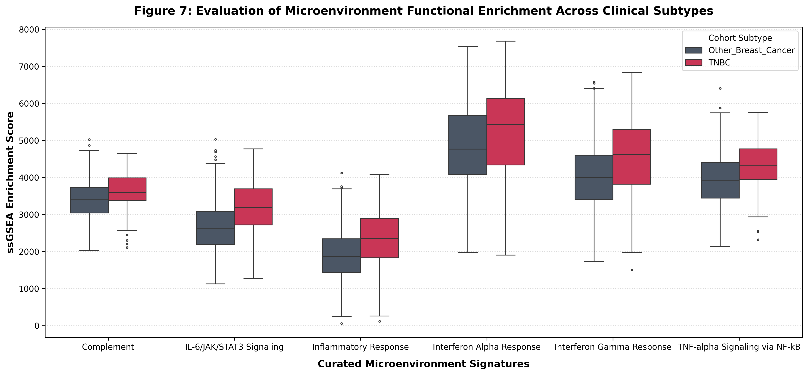
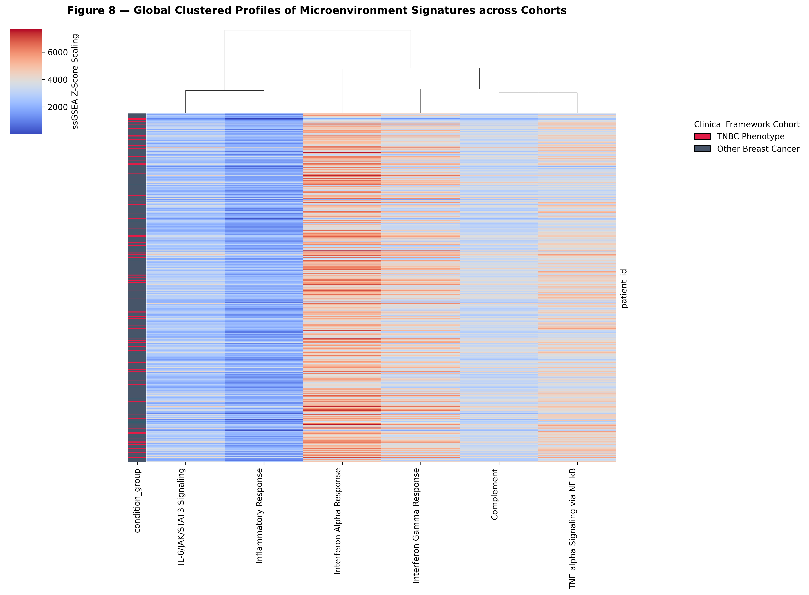
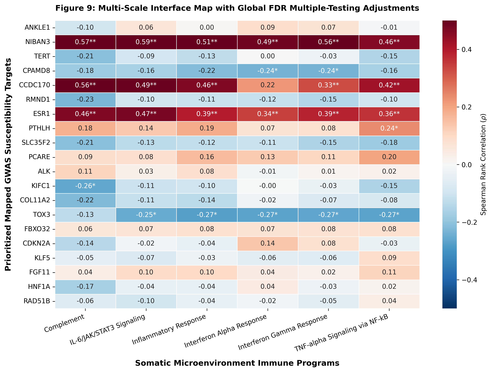
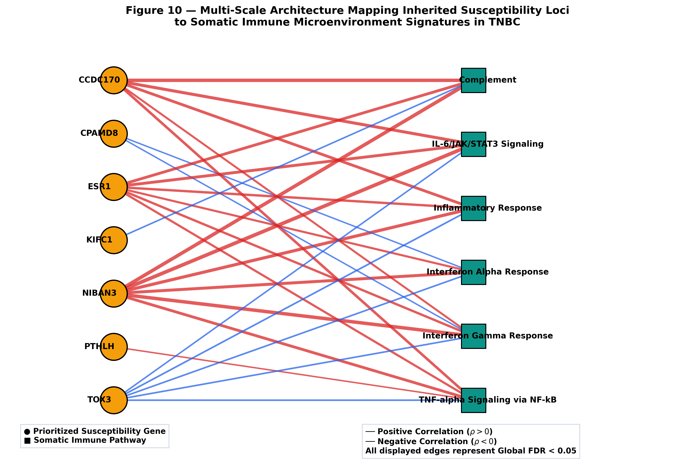

# Integrative Multi-Omics Analysis of Breast Cancer Susceptibility and Tumor Immune Programs in Triple-Negative Breast Cancer
A reproducible computational biology workflow integrating GWAS susceptibility loci, TCGA RNA-seq, functional enrichment, ssGSEA immune profiling, and network analysis to identify immune-associated candidate genes.

**Dataset:** TCGA-BRCA (The Cancer Genome Atlas Breast Invasive Carcinoma)

**Platform:** Illumina HiSeq RNA-Sequencing (RNA-seq)

**GWAS Resource:** NHGRI-EBI GWAS Catalog Breast Cancer Susceptibility Loci

**Cohort Analyzed:** 710 Molecularly Characterized Breast Tumor Samples

---

# Abstract

## Background

Triple-negative breast cancer (TNBC) is an aggressive molecular subtype characterized by extensive transcriptional dysregulation, poor clinical outcomes, and a highly dynamic tumor immune microenvironment. Although genome-wide association studies (GWAS) have identified numerous germline susceptibility loci associated with breast cancer risk, the functional relationships between inherited susceptibility genes and immune programs operating within established TNBC tumors remain incompletely understood.

This study integrates GWAS-derived susceptibility genes with bulk RNA-seq transcriptomics and immune pathway profiling to identify candidate genes linking inherited genetic risk to the immune landscape of TNBC.

---

## Methods

A reproducible computational workflow was developed using RNA-seq and clinical data from the TCGA-BRCA cohort together with curated breast cancer susceptibility loci obtained from the NHGRI-EBI GWAS Catalog. GWAS summary statistics were processed and mapped to candidate susceptibility genes prior to integration with tumor transcriptomic data.

RNA-seq count data underwent quality control, normalization, and differential expression analysis using **pyDESeq2**, with statistical significance determined using Benjamini–Hochberg false discovery rate (FDR) correction. Functional interpretation was performed using Gene Ontology (GO), KEGG, Reactome, and MSigDB Hallmark over-representation analyses.

GWAS-mapped susceptibility genes were integrated with TNBC differentially expressed genes to identify prioritized candidate genes linking inherited susceptibility with tumor-specific transcriptional remodeling. Patient-level immune pathway activity was quantified using single-sample Gene Set Enrichment Analysis (ssGSEA), followed by immune landscape comparisons, global Spearman correlation analysis, and bipartite network construction to characterize relationships between susceptibility genes and immune signaling programs.

---

## Results

Differential expression analysis identified **2,947 significantly dysregulated genes** distinguishing TNBC from other breast cancer subtypes.

Integration with **193 curated breast cancer susceptibility genes** identified **20 overlapping candidate genes**, representing potential convergence points between inherited susceptibility and tumor transcriptional remodeling.

Functional enrichment implicated biological processes associated with apoptosis, protein kinase signaling, inflammatory responses, and miRNA-mediated regulation.

Immune profiling demonstrated significantly elevated Complement, Interferon-α Response, Interferon-γ Response, Inflammatory Response, IL6/JAK/STAT3 Signaling, and TNFα/NFκB Signaling within TNBC tumors.

Multi-scale correlation analysis identified **NIBAN3, ESR1, and CCDC170** as genes exhibiting coordinated positive associations across multiple immune pathways, whereas **TOX3** displayed consistent negative immune associations. Bipartite network analysis further highlighted these genes as central interfaces connecting inherited breast cancer susceptibility with tumor immune programs.

---

## Conclusions

This study presents a reproducible systems biology workflow integrating germline susceptibility, bulk RNA-seq transcriptomics, functional pathway analysis, immune pathway profiling, and network biology to investigate immune-associated mechanisms in TNBC.

By prioritizing susceptibility genes exhibiting coordinated relationships with immune pathway activity, this framework generates biologically informed hypotheses regarding potential regulators of the TNBC immune microenvironment while providing a reusable computational workflow for integrative cancer genomics research.

---

# Key Analytical Outputs

<table>
  <tr>
    <td></td>
    <td></td>
    <td></td>
  </tr>
  <tr>
    <td></td>
    <td></td>
    <td></td>
  </tr>
  <tr>
    <td></td>
    <td></td>
    <td></td>
  </tr>
  <tr>
    <td></td>
    <td></td>
    <td></td>
    <td></td>
  </tr>
</table>

---

# Key Highlights

* End-to-end reproducible computational biology workflow integrating germline genetics, transcriptomics, and immune pathway analysis
* Analysis of **710 TCGA-BRCA** molecularly characterized breast tumors
* Processing and mapping of breast cancer GWAS summary statistics
* Identification of **2,947** TNBC-associated differentially expressed genes
* Integration of **193 curated susceptibility genes** with tumor transcriptomics
* Prioritization of **20 candidate genes** linking inherited susceptibility and TNBC biology
* Functional characterization using GO, KEGG, Reactome, and MSigDB Hallmark enrichment analyses
* Patient-specific immune profiling using ssGSEA across six Hallmark immune signatures
* Identification of **NIBAN3, ESR1, CCDC170, and TOX3** as prominent immune-associated susceptibility genes
* Systems-level visualization of gene–immune relationships using bipartite network analysis

---

# Methods Snapshot

| Component               | Method                                                      |
| ----------------------- | ----------------------------------------------------------- |
| GWAS processing         | GWAS Catalog summary statistics processing and gene mapping |
| RNA-seq preprocessing   | CPM normalization and log₂(CPM + 1) transformation          |
| Differential expression | pyDESeq2 generalized linear model                           |
| Multiple testing        | Benjamini–Hochberg FDR                                      |
| Functional enrichment   | GO, KEGG, Reactome, MSigDB Hallmark ORA                     |
| Multi-omics integration | GWAS susceptibility genes ∩ TNBC differential expression    |
| Immune profiling        | ssGSEA (MSigDB Hallmark immune signatures)                  |
| Statistical testing     | Mann–Whitney U test, Spearman correlation                   |
| Network analysis        | Bipartite gene–immune interaction network                   |

---

# Pipeline Overview

This repository implements a **10-notebook computational biology workflow** progressing from GWAS processing and transcriptomic analysis to systems-level integration of inherited susceptibility and tumor immune biology.

## Workflow Summary

### Notebook 01 — GWAS Summary Statistics Processing

* Import and curate breast cancer GWAS summary statistics
* Filter significant susceptibility loci
* Prepare GWAS data for downstream gene mapping

### Notebook 02 — GWAS Gene Mapping

* Map susceptibility loci to candidate genes
* Generate curated susceptibility gene list
* Prepare genes for transcriptomic integration

### Notebook 03 — TCGA RNA-seq Processing

* Import TCGA-BRCA RNA-seq counts and clinical metadata
* Curate TNBC and non-TNBC cohorts
* Perform quality control and preprocessing

### Notebook 04 — Differential Expression Analysis

* Differential expression using pyDESeq2
* Volcano plot visualization
* Identification of TNBC transcriptional signature

### Notebook 05 — Multi-Omics Integration

* Integrate GWAS susceptibility genes with TNBC transcriptomics
* Hypergeometric overlap analysis
* Prioritize candidate susceptibility genes

### Notebook 06 — Functional Enrichment Analysis

* GO enrichment
* KEGG enrichment
* Reactome enrichment
* Hallmark pathway enrichment

### Notebook 07 — ssGSEA Immune Signature Scoring

* Calculate log₂(CPM + 1) normalized expression
* Compute ssGSEA immune pathway scores
* Generate patient-level immune profiles

### Notebook 08 — Immune Characterization

* Compare immune pathway activity between TNBC and non-TNBC
* Mann–Whitney U testing
* Heatmaps and immune pathway visualization

### Notebook 09 — Multi-Scale Risk–Immune Correlation

* Correlate prioritized susceptibility genes with immune pathway activity
* Spearman rank correlation
* Global FDR correction
* Identification of immune-associated susceptibility genes

### Notebook 10 — Bipartite Network Construction

* Construct gene–immune interaction network
* Visualize significant associations
* Integrate differential expression with immune correlation patterns

---

# Repository Structure

```text
tnbc-risk-immune-integration/
│
├── data/
│   ├── gwas/
│   └── rna_seq/
│
├── notebooks/
│   ├── 01_gwas_summary_statistics_processing.ipynb
│   ├── 02_gwas_gene_mapping.ipynb
│   ├── 03_tcga_rnaseq_processing.ipynb
│   ├── 04_differential_expression_analysis.ipynb
│   ├── 05_multi-omics_integration.ipynb
│   ├── 06_functional_enrichment_analysis.ipynb
│   ├── 07_ssgsea_immune_signature_scoring.ipynb
│   ├── 08_immune_characterization.ipynb
│   ├── 09_multiscale_risk_immune_correlation.ipynb
│   └── 10_bipartite_network_construction.ipynb
│
├── results/
│   ├── figures/
│   └── tables/
│
├── requirements.txt
└── README.md
```

---

# Reproducibility

```bash
git clone https://github.com/username/tnbc-risk-immune-integration.git

cd tnbc-risk-immune-integration

conda create -n tnbc_env python=3.10

conda activate tnbc_env

pip install -r requirements.txt
```

---

# Limitations

* Analyses are based on retrospective TCGA transcriptomic data without independent external validation.
* Bulk RNA-seq measurements cannot resolve cell-type-specific contributions to immune signaling.
* Correlation analyses identify statistical associations rather than causal regulatory relationships.
* GWAS-mapped genes represent candidate susceptibility genes and may not necessarily correspond to the causal genes underlying each association locus.
* Experimental validation will be required to establish the functional roles of prioritized candidate genes.

---

# Future Directions

Potential extensions of this workflow include:

* External validation in independent breast cancer cohorts (e.g., GEO or METABRIC).
* Integration of single-cell RNA-seq datasets to resolve cell-type-specific immune interactions.
* Incorporation of protein interaction and gene regulatory network analyses.
* Integration with spatial transcriptomics to investigate immune spatial organization.
